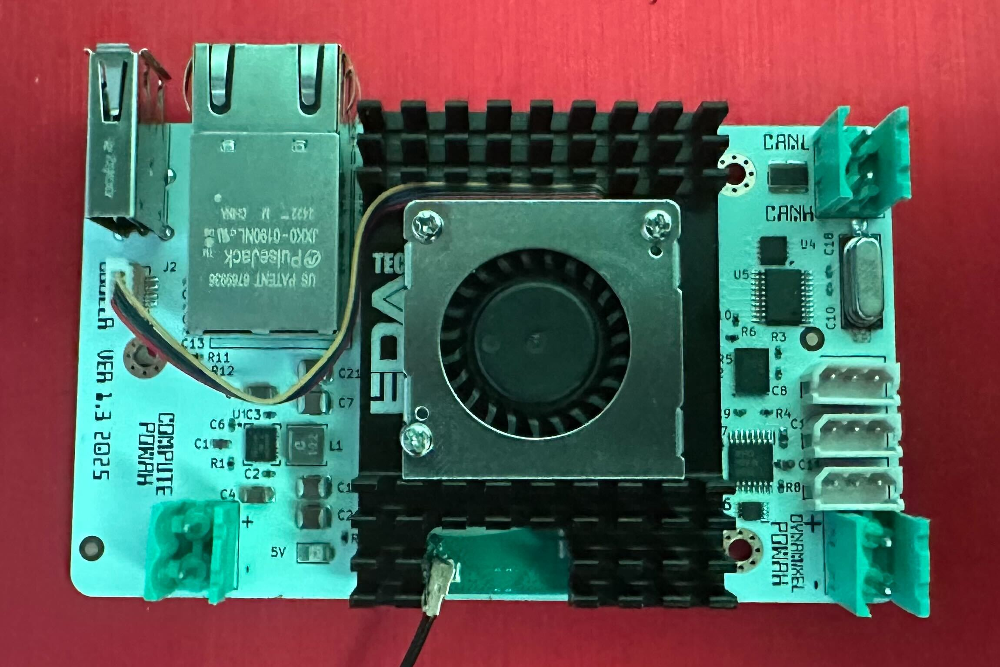

# Overlord Robot Controller

## Overview

"Overlord" is a carrier board for the Raspberry Pi Compute module 5. The board facilitates easy integration with [Xiaomi Cybergear](https://www.mi.com/cyber-gear) motors and half duplex Dynamixels, like the [AX-12A](https://emanual.robotis.com/docs/en/dxl/ax/ax-12a/), [MX-12W](https://emanual.robotis.com/docs/en/dxl/ax/ax-12a/) servos.

The carrier board has an onboard can controller, can transciever, a 9 axis IMU with 100Hz sensor fusion, half duplex line driver circuitry for Dynamixel servos and has an acceptable power input range from 5 to 36V.

This repository contains:
* All the necessary KiCad schematics, PCB layout and gerber files for making copies of the carrier board.
* boot/firmware/config.txt (for the necessary boot overlays and IO mappings).
* Go code examples for communicating with Dynamixels, Cybergears and the IMU.
* Go code examples for how to implement remote control via a bluetooth gamepad, FrSky [XSR-SIM](https://www.frsky-rc.com/product/xsr-sim/) (or similar HID device).

## Licensing
This is open hardware and software. Licensing terms can be found [here](LICENSE.md).

> ⚠️ **Note**: Use of this repository’s contents for AI/ML training is strictly prohibited. See [DO-NOT-TRAIN.md](./DO-NOT-TRAIN.md) for details.

## Getting started

In addition to the carrier board, you will need a 
* [Compute module 5](https://datasheets.raspberrypi.com/cm5/cm5-datasheet.pdf). 
* [Raspberry Pi Development Kit for Compute Module 5](https://www.raspberrypi.com/products/cm5-dev-kit/)
* If you plan to use wifi, I strongly suggest getting the official Raspberry Pi Compute module 4/5 antenna kit.
* A passive or active cooler for the CM5. If using an active cooler, attach the FAN connector to the "COOLER" socket on the carrier board.

### Programming the CM5

1. The compute module has to be flashed with an operating system before it can be used. Information on how to do this is available in the ["Compute Module Hardware"](https://www.raspberrypi.com/documentation/computers/compute-module.html#flash-compute-module-emmc) section on the offical [raspberrypi.com](https://www.raspberrypi.com/) site. Remember to enable SSH in the OS customisation settings before flashing the module.
1. Mount the CM5 in the carrier board and attach a battery or power supply to the "COMPUTE POWAH" port. Observe polarity. There is no reverse polarity protection circuitry. Reversing polarity will in all likelyhood fry the carrier board.
1. The blue LED on the carrier board will light up, indicating that it has 5V power. 
1. The CM5 will require a few seconds to boot before you can ssh in. (Tip: create an .ssh folder under the CM5 home folder and copy your public key to ./ssh/authorized_keys. You can then "ssh hostname" without having to type in a password)
1. The compute module will announce itself on the network. Given a "hostname", you should now be able to "ssh hostname" to get shell access.
1. Once you have shell access, run "sudo raspi-config" to enable i2c, spi and UART (enable serial port hardware, but not serial shell).
1. Now you can "sudo vi /boot/firmware/config.txt. Update the config.txt according to the [config.txt](./config/config.txt) in this repository. 
1. Run "sudo reboot now" to reboot the module. This makes sure that the correct overlays are loaded and that the GPIO mappings are correct.

You are now all set to start playing around with the board.

## Configuration and code examples

* [Remote control](./firmware/examples/remote-control/README.md)
* [Dynamixel](./firmware/examples/dynamixel/README.md)
* [Xiaomi Cybergear](./firmware/examples/cybergear/README.MD)
* [IMU](./firmware/examples/imu/README.md)

## Networking

This board was designed for simplicity and ease of use with the primary goal being actuator control and balancing. Apart from the onboard IMU, there is no sensing or GPIO access. It is however possible to directly connect the board to another Pi or any other board that supports Auto MDI-X directly using a standard ethernet cable. Access to GPIO, camera etc can then be implemented via a simple tcp client/server.

