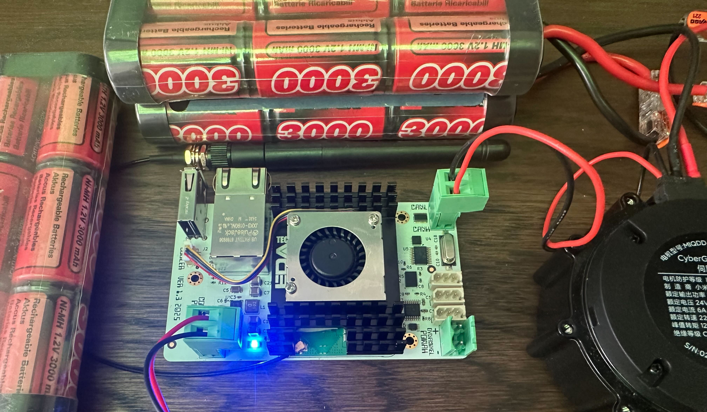

# Getting started - Xiaomi Cybergear




## Verifying that the can interface is ok

1. Install can utils

```sh
sudo apt install can-utils
```

2. Verify that the MCP2515 driver is initialized

```sh
dmesg | grep -i mcp
```
This should generate the following response:
```sh
mcp251x spi0.0 can0: MCP2515 successfully initialized.
```

3. Bring up can0.
```sh
sudo ip link set can0 up type can bitrate 1000000
```

## Initial test

With the board still powered up (battery / powersupply) connected to the "COMPUTE POWAH" port.

1. Connect the thin red wire from the Amass XT30(2+2) connector to CANH on the board.
2. Connect the thin black wire from the Amass XT30(2+2) connector to CANL on the board
3. Run the following command from the ssh shell

```sh
candump can0
```

candump is now running. 

Now you can connect power to the Cybergear via the thick red and black wires on the Amass XT30(2+2) connector. You should now see the following output from candump (0x7F is the default motor address):

```sh
can0  00007FFE   [8]  41 11 31 31 30 33 31 0A
```

### Code examples

* [position example README](./position/README.md)
* [position example code](./position/position.go)

### Resources

* [English translation of the Cybergear manual](https://github.com/belovictor/cybergear-docs/blob/main/instructionmanual/instructionmanual.md). This contains a description of the frame format and commands.
* [Open ELAB manual](https://openelab.io/blogs/learn/xiaomi-cybergear-motor-driver?srsltid=AfmBOorAWpRj6DeV5K0sDiB9xCP05Z2zYvFDgJgBuiwv-h65VWlq3OZl)