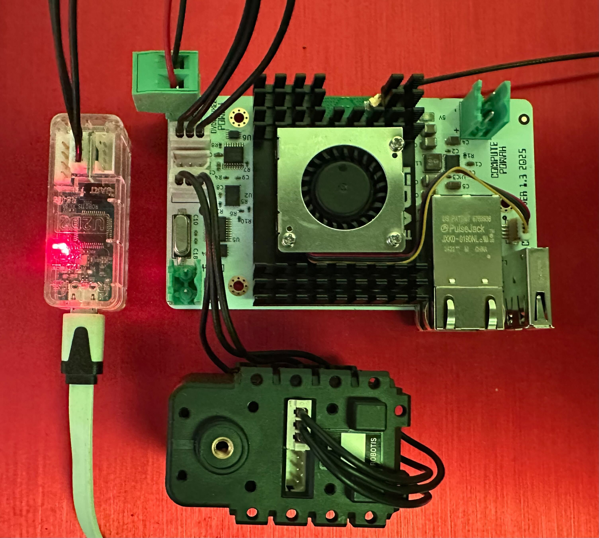
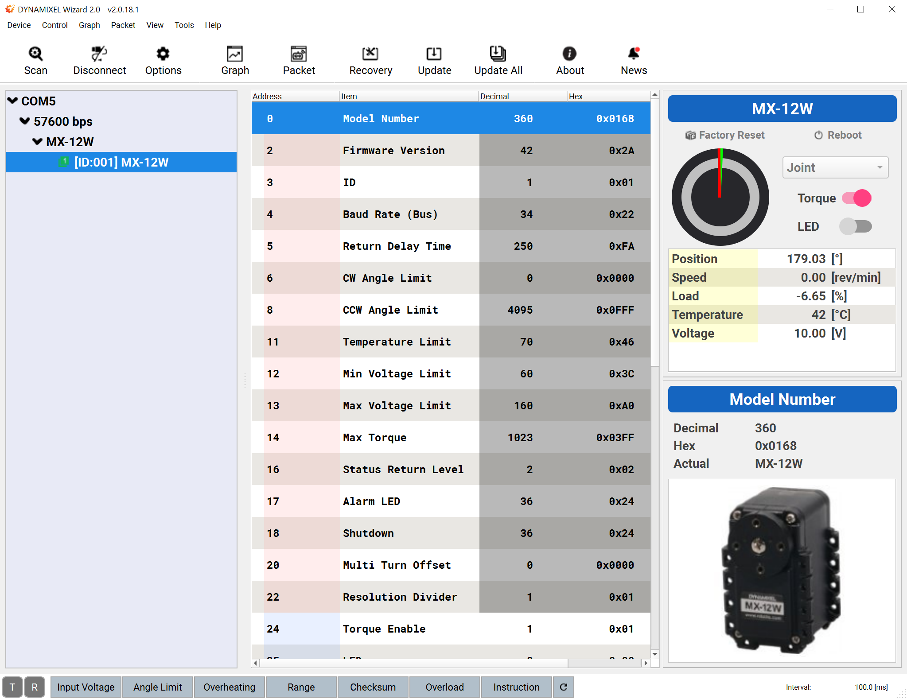

# Getting started - Dynamixel

## Parametrization

Dynamixel servos have EEPROM + RAM control tables for parametrization (ID, baud rate, voltage limits etc). Since all servos are daisy chained and connected to the same communication bus, you will have to configure the servo ID and communication baud rate for each servo. This can be done in code, using [DYNAMIXEL protocol 2.0](https://emanual.robotis.com/docs/en/dxl/protocol2/) for AX-12A servos or [DYNAMIXEL protocol 1.0](https://emanual.robotis.com/docs/en/dxl/protocol1/) for MX-12W servos.

Since it is relatively easy to shoot yourself in the foot when parametrizing these servos (by changing baud rate etc), I highly recommend getting hold of a [U2D2 USB Communication converter](https://emanual.robotis.com/docs/en/parts/interface/u2d2/). Servo power has to be provided externally. You can use a separate power distributuion board together with the U2D2 when parametrizing the servos, or you can connect the U2D2 to the CM5 carrier board.

1. Connect the U2D2 to one of the dynamixel sockets on the carrier board.
1. Connect the U2D2 to your computer using a USB micro B to USBA cable.
1. Connect your servo to one of the remaining ports (multiple servos can be connected in serial by daisy chaining them).
1. Connect a battery pack or power supply to the "DYNAMIXEL POWAH" connector. Observe polarity, since this feeds directly into the servo power line. Do not connect anything to "COMPUTE POWAH" when doing this, since the carrier board just acts as a power distribution board / hub for the U2D2 when we parametrize the control tables.

Once everything is hooked up and servo power is applied, you can use [Dynamixel Wizard](https://emanual.robotis.com/docs/en/software/dynamixel/dynamixel_wizard2/) to scan for servos in the network and also configure them (ID, baud rate etc)

> Note: If you are feeling brave, it is entirely possible to do this parametrization in code, but that means that someone (most likely you) will have to write a bit of extra code before you can play around with the servos and the controller board:)

### Code examples

* [Scanning the network](./scan/README.md)

### Resources

* [Dynamixel SDK](https://emanual.robotis.com/docs/en/software/dynamixel/dynamixel_sdk/overview/)
* [Dynamixel Protocol 1.0](https://emanual.robotis.com/docs/en/dxl/protocol1/)
* [Dynamixel Protocol 2.0](https://emanual.robotis.com/docs/en/dxl/protocol2/)
* [Dynamxiel Wizard](https://emanual.robotis.com/docs/en/software/dynamixel/dynamixel_wizard2/)
* [U2D2 interface](https://emanual.robotis.com/docs/en/parts/interface/u2d2/)

