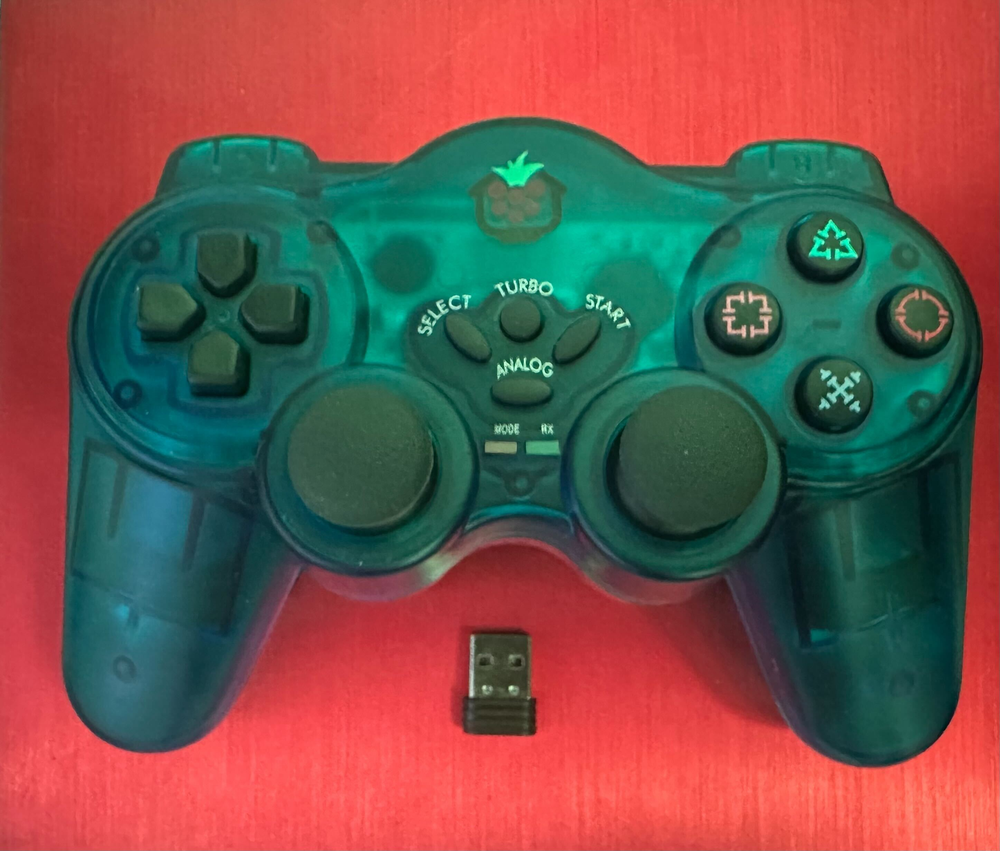

# Remote control

An ordinary gamepad can be used for remote control of the carrier board. In this example we'll use a generic gamepad with a bluetooth USB dongle. This will appear as a HID device on the CM5 and will be accessible as /dev/input/js0




The example program is meant as an illustration of how to access the input HID device and decode events from the gamepad. 

## Cross compiling the Go example code

1. Set the following environment variables (syntax may vary depending on your OS flavour),

```sh
GOOS=linux 
GOARCH=arm64 
GOARM=8
```

2. Compile the example program 

```sh
go build -o joysticktest
```

3. Upload the binary to your board using scp (host name is "overlord" in the example)

```sh
scp joysticktest overlord:
```

4. ssh to your board and run the joysticktest program (chmod +x if it isn't executable)

```sh
ssh overlord
chmod +x joysticktest
./joysticktest
```

The program will list the status of all gamepad buttons and axis. Pressing a button or moving one of the axis will result in an event that is listed on the screen.


